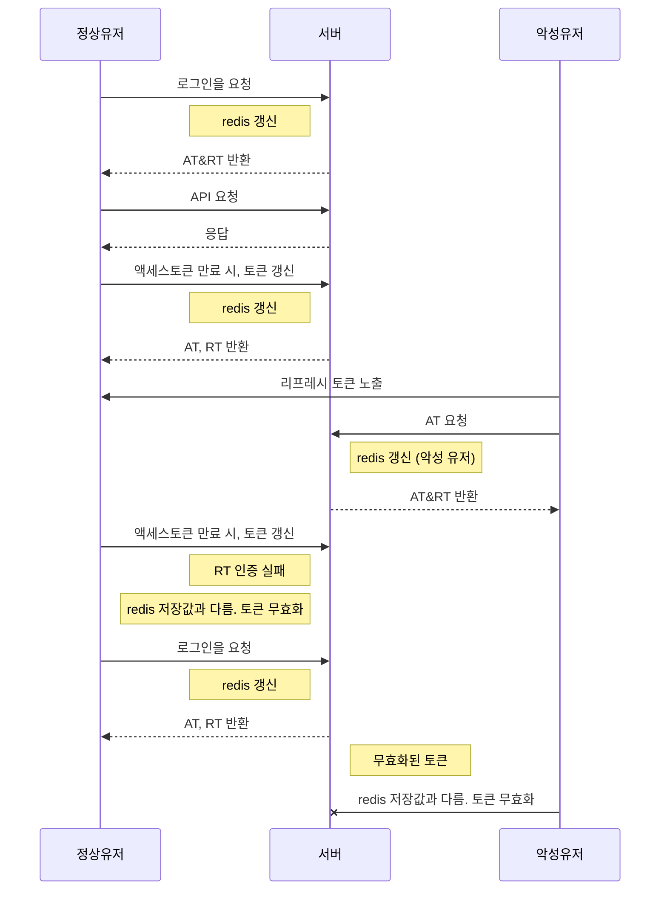

## 날짜: 2024-07-14

## 스크럼

- 목표 1 : RTR + Redis

## 공부한 내용

### RT 탈취 시나리오

- 아직 사용되지 않은 RT를 해커가 탈취해서 유저보다 먼저 사용
    - 사용된 RT인 경우 발급을 거부함 ( 유저가 redis에 이미 새 RT로 갱신 했기 때문 )
- 그렇다면 해커가 RT를 재발급 받은 후 정상 유저의 요청이 들어왔을때, 유저가 가지고 있던 RT와 레디스에 저장된 RT(공격자가 갱신 한 것) 이 다르다.
- 따라서 공격이 있었음을 알게 되고, 토큰을 무효화 시켜서 해커가 RT를 사용할 수 없게 된다.

다른 경우 redis에서 해당 유저의 {email:rt} 데이터를 삭제하고 클라이언트가 재로그인 하게 해야한다.

*왜 redis를 사용했는가?

→ 빠른 접근 속도로 사용자 로그인시(RT 발급시) 병목 X

→ 데이터 유효기간 (TTL) 적용 가능. RT의 만료시간에 맞춰 삭제 할 수 있음
