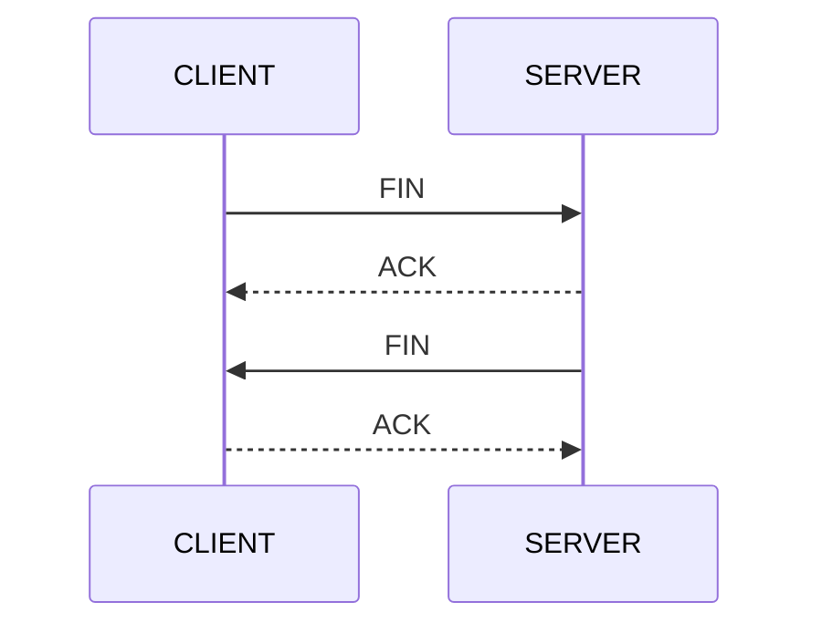
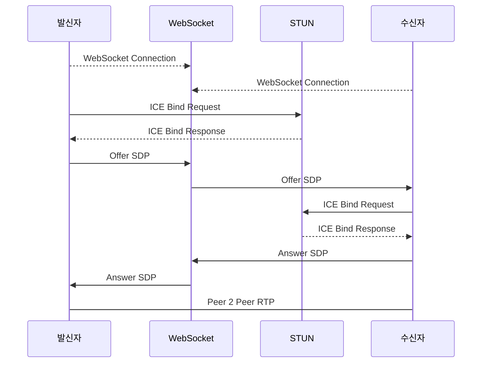

## 날짜: 2024-07-23

## 공부한 내용

## TCP와 UDP

인터넷은 네트워크 상에 자신의 식별 번호가 공유되는 환경에서 정보 교환이 이루어 지는 것

인터넷에서 정보교환의 방식은 TCP와 UDP 로 나뉜다.

TCP 방식이 가장 많이 활용되며, UDP는 네트워크 노드정보 교환이나 미디어 처리에 활용

## TCP : Transport Control Protocol

TCP는 컴퓨터 간 접속과 송수신이 보장되는 환경에서 진행되는 방식

정보를 제공하는 Server와 그 정보를 요청하는 Client의 관계에서 **세션접속 → 데이터 송수신 → 세션 해제** 순으로 진행된다.

### 세션 접속

**세션접속 → 데이터 송수신 → 세션 해제**

- 위 순서로 진행되며, 세션이 유지되는 정보교환이 가능한 상태를 의미
- 이때부터, SERVER/CLIENT 양측에서 DATA/ACK의 순으로 송수신이 가능하며, SERVER에서 CLIENT로 보내는 DATA를 PUSH라고 한다.
    
    ```mermaid
    sequenceDiagram
        participant CLIENT
        participant SERVER
    
        CLIENT->>SERVER: DATA
        SERVER-->>CLIENT: ACK
        SERVER->>CLIENT: DATA
        CLIENT-->>SERVER: ACK
    
    ```
    
- 전송되는 데이터는 반드시 반대쪽에서 ACK 응답을 전송해야 하며, ACK응답이 없을 경우, 네트워크 상의 대기시간이 누적되어 접속이 끊어집니다.

### 세션 해제

**4 Way Handshake**



- 세션 해제는 CLIENT/SERVER 양측에서 서로 교환하여 처리
- 해당 과정이 마무리 되어야만 SERVER에서 CLIENT 세션 자원이 해제되어, 이후 CLIENT에 대한 세션 재 접속이 가능
- 특히, TCP에서의 세션해제관리는 매우 중요
    - CLIENT의 경우 SERVER에 비해 전원이 내려가거나, 기타원인으로 인한 세션 종료 현상이 자주 발생되어, SERVER에서 해당 CLIENT가 종료되었다는 상황을 인지 못해 인터넷 상에서의 원활한 TCP 진행이 불가한 문제 발생
    - 이를 해결하기 위해 CLIENT는 세션 접속 이후, 일정 시간 주기의 더미데이터 전송을 통해 SERVER에서 CLIENT의 접속 유지 여부를 가늠하여, 일정 시간 이상 미  수신시 세션을 강제 해제하는 장치를 구현해야 함

---

- HTTP는 TCP기반의 웹 처리 프로토콜이다.
- 브라우저에서 인터넷을 통해 정보를 조회할 때 사용하는 것이 HTTP인데, TCP 세션접속을 하여, 브라우저 요청을 하고, 서버의 응답을 받으면 세션을 해제하는 과정을 거치게 된다.
- 브라우저에서 HTML문서를 출력할 때, 이미지 등의 정보가 필요하면, TCP세션의 접속과 데이터 송수신, 해제의 자동반복을 통해 완성된 페이지를 출력하는 과정을 수행합니다.
- TCP 세션의 접속과 해제의 과정으로 인해, 부하가 생기는 문제점이 있으나, 정확한 데이터 송/수신을 처리하는 장점이 있습니다.

## UDP : User Datagram Protocol

- UDP는 정확한 데이터를 송수신하는 TCP와는 다르게 수신여부와 상관 없이  데이터를 전송하는 방식
- 그렇기 때문에, 정확한 송수신을 보장 못하는 단점이 있으며, 대용량의 데이터 전송이 가능한 장점이 있어서 스트리밍, 인터넷 전화등의 미디어 처리에 사용된다
- 접속과 해제의 방식이 없는 비 연결 방식으로 불 특정 다수를 향해 데이터 전송이 가능한 장점이 있어, DNS 등의 시스템 노드간 정보 교환에 활용됩니다.

### UDP의 정보 교환 방식

- 유니캐스팅
    - 특정 아이피를 지정하여 데이터를 전송
- 브로드캐스팅
    - 특정 그룹인 다수를 향해 데이터를 전송하는 브로드 캐스팅

---

- UDP는 TCP처럼 SERVER에서 CLIENT의 세션 접속을 대기하는 방식관 달리, 송/수신측 모두 데이터를 읽어들이는 RECEVIER를 만들어야 합니다.
- UDP는 세션을 제어하는 TCP와 다르게 전송처리에 대한 보장이 없더라도 대량의 데이터를 송신하는 미디어처리에 주로 활용합니다.

- TCP에  HTTP가 있듯이, UDP에는 SIP(Session Initation Protocol) 라는 규격이 있는데, SIP는 컴퓨터 간의 실시간 음성/영상을 교환하기 위한 환경을 구축해 주는 프로토콜이다.
- 이렇듯 UDP는 SIP 프로토콜을 이용하여 미디어처리와 관련된 통화, 화상등의 인터넷 전화 기술에 활용되고 있다

## WebRTC 기초

## 개요

- 2010년 이후 WebSocket이 등장하고 크롬 브라우저가 차례로 등장하기 시작하면서 WebRTC라는 기술을 통해 브라우저에서도 통화가 가능해지기 시작
- 2011년 W3C에서 WebRTC를 발표.
    - 구글과 에릭슨사가 웹 브라우저 기반의 실시간 통신 기능을 추가할 수 있도록 실시간 통신 기능을 추가할 수 있도록 진행한 프로젝트를 W3C가 API 정의를 진행
- 음성/영상 통화는 물론 채팅, 파일 공유까지 별도의 서버를 거치지 않고 브라우저와 브라우저간 통신을 처리하는 Peer To Peer 방식을 지원
- 개발자들은 WebRTC 내부에 미디어 엔진이 내장되어 음성/영상통화 기능이 브라우저에서 가능한 점과 별도 서버를 거치지 않고 Peer To Peer 실시간 통신이 가능한 점에 관심을 보이며 화상통화, 화상회의 등의 기능들을 여러 업체에서 앞다투어 출시
- WebRTC의 음성/영상 통신은 1:1 통화부터 N:N 회의통화, 1:N 인터넷 방송까지 모두 구현 가능
- Peer To Peer 실시간 통신 방식으로 서버부하 문제와 비용문제를 절약 가능
- 기존 SIP프로토콜만을 이용한 방식에 비해 보다 쉬운 구현이 가능해짐

## WebRTC 구조

브라우저에서 작동하는 WebRTC의 구조는

- JavaScript 에서 접근 할 수 있는 API
    - Peer간 통화를 형성시키는 Signaling 정보를 설정하면 바로 음성/영상 통화 기능을 구현할 수 있도록 WebRTC의 API에서 지
- Peer To Peer 연결을 가능케 하는 PeerConnection
- 아이피/포트/코덱 등 통화환경을 WebSocket등을 이용해 처리하는 Signaling
- Peer간 미디어 전송을 처리하는 Transport
- 음성 / 영상 엔진

으로 구성되어 있다.

## WebRTC는 브라우저의 JS Engine에 포함된 라이브러리

- WebRTC를 작동시키기 위해 `WebSocket`, `STUN`, `TURN`서버를 이용하여 실시간 음성/영상 통화기능을 진행하게 된다.
- Peer to Peer 실시간 통화를 진행한다는 의미는 음성/영상 데이터가 브라우저와 브라우저간 직접 연결되어 데이터 교환이 이뤄진단 의미
- 브라우저간 접속을 위해 아이피, 포트, 코덱정보를 서로 교환하기 위한 신호처리 서버들이 필요
- WebSocket 서버는 통화 요청 및 Peer간 접속을 위한 정보를 전달하는 역할
- STUN 서버는 ICE라는 규격을 이용하여 상대방의 접속을 할 수 있게 지원
- TURN은 Peer간 데이터 통신이 불가한 경우 데이터를 중계

### 발신측에서 수신측 통화 요청 절차



- 수신측에서 접근하기 위한 자신의 접근 정보를 알아내기 위해 STUN서버에 요청을 하여 그 정보를 가져온다.
- STUN으로 부터 응답받은 정보를 취합하여 통화요청을 하기 위한 정보를 WebSocket서버를 통해 수신측에 전달
- 통화요청을 받은 수신측은 이를 확인하여 발신측과 마찬가지로 STUN서버에 요청을 하여 발신측에서 접근하기 위한 정보를 취합 후
- WebSocket 서버를 통해 통화요청을 수락한단 정보를 발신자에게 전달
- 발신과 수신측 모두 통화에 필요한 정보들이 공유되어 SRTP 프로토콜을 이용한 통화가 이뤄진다

## 오늘의 작업

### 목록

- [ 다오 ] 기획
- NEXT 부분사전렌더링
- TCP UDP 기초 이론
- webRTC 기초 이론

### 작업시간


